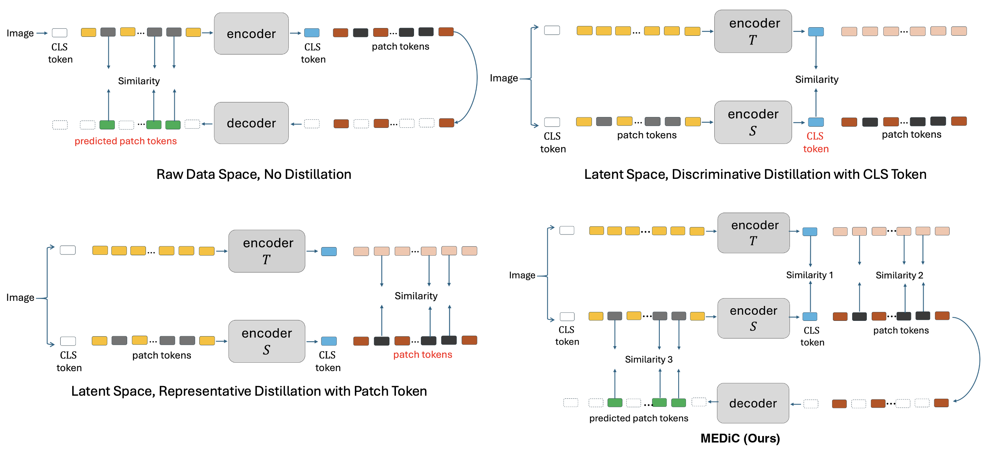

# MEDiC: Multi-objective Exploration of Distillation from CLIP

**Official PyTorch implementation of ["MEDiC: Multi-objective Exploration of Distillation from CLIP"](https://arxiv.org/abs/2603.29009).**

MEDiC extends masked image modeling with CLIP distillation by combining three complementary training objectives: token distillation, CLS token alignment, and pixel reconstruction. We show that jointly optimizing these objectives produces stronger visual representations than any single objective alone, achieving 73.92% k-NN accuracy on ImageNet-1K with a ViT-Base student.

**[Pre-trained Weights](https://huggingface.co/drkostas/MEDiC-ViT-Base)** | **[Paper](https://arxiv.org/abs/2603.29009)** | **[MaskDistill Base](https://github.com/drkostas/MaskDistill-PyTorch)** | <a href="https://huggingface.co/spaces/drkostas/MEDiC-Evolved-Masking"></a>

## Key Results (ViT-B/16, ImageNet-1K)

| Evaluation | Result |
|------------|:------:|
| k-NN (k=10) | **73.92%** |
| Linear Probe (top-1) | **60.50%** |
| Finetuning (top-1) | **85.07%** |
| Sem. Seg. (mIoU, ADE20K) | **52.5** |

### Loss Ablation (Table 4)

| Training Objectives | k-NN |
|---------------------|:----:|
| Token only (MaskDistill baseline) | 68.6% |
| Token + Pixel | 71.4% |
| Token + CLS | 72.3% |
| Token + Pixel + CLS (MEDiC) | **73.92%** |

Each additional objective provides complementary learning signals: pixel reconstruction encourages fine-grained spatial features, while CLS alignment captures global semantic structure.

## Overview

MEDiC combines masked image modeling with knowledge distillation from a frozen CLIP teacher using three loss terms:

1. **Token Distillation (L_head)**: Smooth L1 loss between student predictions and CLIP teacher features on masked positions
2. **CLS Alignment (L_cls)**: Cosine similarity between student and teacher CLS token embeddings
3. **Pixel Reconstruction (L_pix)**: L2 loss from an MAE-style decoder reconstructing normalized pixel patches

The total loss is: `L_total = w_head * L_head + w_cls * L_cls + w_pix * L_pix`

Additionally, MEDiC introduces **Evolved Part Masking with Hierarchical Clustering**, which progressively transitions from spatial to semantic masking using the CLIP teacher's attention patterns for part discovery.

<p align="center">
  
</p>

The bottom-right panel shows the full MEDiC framework with all three loss paths (Similarity 1 = token distillation, Similarity 2 = CLS alignment, Similarity 3 = pixel reconstruction).

## Installation

```bash
git clone https://github.com/aicip/MEDiC.git
cd MEDiC

python -m venv .venv
source .venv/bin/activate
pip install -r requirements.txt
```

**Requirements:** Python 3.10+, PyTorch 2.1+, CUDA 11.8+.

For downstream evaluation (semantic segmentation and object detection), also install:
```bash
# Requires Python 3.12 or earlier (mmcv-full does not support 3.13+)
pip install mmcv-full==1.7.2 -f https://download.openmmlab.com/mmcv/dist/cu121/torch2.4/index.html
pip install mmsegmentation==0.30.0 mmdetection==2.28.2
```

## Setup

### 1. Dataset Paths

Download [ImageNet-1K](https://image-net.org/) and organize as:
```
/path/to/imagenet/
├── train/
│   ├── n01440764/
│   └── ...
└── val/
    ├── n01440764/
    └── ...
```

Update data paths in config files:
- **Pretrain configs** (`configs/pretrain*.yaml`): Set `data.data_path`, `data.train_dir`, `data.val_dir`
- **Semseg config** (`src/downstream/segmentation/configs/`): Set `data_root` to your [ADE20K](http://sceneparsing.csail.mit.edu/) path
- **Detection config** (`src/downstream/detection/configs/`): Set `data_root` to your [COCO](https://cocodataset.org/) path

### 2. SLURM Configuration (for cluster users)

All scripts in `scripts/` have placeholders you must configure for your cluster:
```bash
#SBATCH -A YOUR_ACCOUNT       # Your SLURM account
#SBATCH --qos=YOUR_QOS        # Your QoS (e.g., normal, high)
#SBATCH --partition=YOUR_PARTITION  # Your partition (e.g., gpu, a100)
```

Also uncomment and adjust the module loads:
```bash
# module load cuda   # Uncomment and set your CUDA module
# module load cudnn  # Uncomment and set your cuDNN module
```

### 3. Weights & Biases (optional)

W&B logging is enabled by default. Set your entity in your config:
```yaml
wandb_meta:
  entity: your-wandb-entity  # or null to use default
```

To disable W&B: `WANDB_MODE=disabled python -m src.train ...`

## Pre-trained Weights

Ablation checkpoints are available on [HuggingFace](https://huggingface.co/drkostas/MEDiC-ViT-Base). Full MEDiC checkpoint (all 3 losses) coming soon.

| Checkpoint | Config | k-NN | Download |
|-----------|--------|------|----------|
| Token + CLS (E200) | `pretrain_token_cls.yaml` | 73.86% | [backbone](https://huggingface.co/drkostas/MEDiC-ViT-Base/resolve/main/token_cls_vit_base_e200.pth) / [full](https://huggingface.co/drkostas/MEDiC-ViT-Base/resolve/main/token_cls_full_e200.pth) |
| Token + Pixel (E299) | `pretrain_token_pixel.yaml` | 71.05% | [backbone](https://huggingface.co/drkostas/MEDiC-ViT-Base/resolve/main/token_pixel_vit_base_e299.pth) / [full](https://huggingface.co/drkostas/MEDiC-ViT-Base/resolve/main/token_pixel_full_e299.pth) |
| MEDiC full (all 3 losses) | `pretrain_medic.yaml` | 73.92% | Coming soon |

## Usage

### Pretraining

```bash
# Single node, 4 GPUs
torchrun --nproc_per_node=4 -m src.train --cfg configs/pretrain_medic.yaml

# SLURM cluster
sbatch scripts/pretrain.sh                                    # default: pretrain_medic.yaml
sbatch scripts/pretrain.sh configs/pretrain_baseline.yaml     # MaskDistill baseline
sbatch scripts/pretrain.sh configs/pretrain_token_pixel.yaml  # Token + Pixel only
```

### k-NN Evaluation

```bash
# Direct
python -m src.eval_knn --cfg configs/pretrain_medic.yaml \
    --weights_folder output/pretrain/<run_folder> --epoch 300

# SLURM
sbatch scripts/eval_knn.sh output/pretrain/<run_folder> 300
```

### Linear Probe

```bash
# SLURM (recommended, needs 4 GPUs, approximately 1 day for 90 epochs)
sbatch scripts/linprobe.sh /path/to/pretrain_checkpoint.pth /path/to/imagenet

# Direct (single node)
cd src/downstream && torchrun --nproc_per_node=4 run_linear_eval.py \
    --pretrained_weights /path/to/pretrain_checkpoint.pth \
    --model_filter_name "module.student." \
    --data_path /path/to/imagenet --epochs 90
```

### Finetuning

```bash
# SLURM (recommended, needs 4 GPUs, approximately 1 to 2 days for 100 epochs)
sbatch scripts/finetune.sh /path/to/pretrain_checkpoint.pth /path/to/imagenet

# Direct (single node)
cd src/downstream && torchrun --nproc_per_node=4 run_class_finetuning.py \
    --finetune /path/to/pretrain_checkpoint.pth \
    --model_filter_name "module.student." \
    --data_path /path/to/imagenet \
    --batch_size 128 --epochs 100 --lr 5e-4 --layer_decay 0.65
```

### Semantic Segmentation

See [downstream/segmentation/README.md](src/downstream/segmentation/README.md) for UPerNet evaluation on ADE20K.

```bash
# SLURM eval (requires mmsegmentation)
sbatch scripts/eval_semseg.sh /path/to/semseg_checkpoint.pth /path/to/ADEChallengeData2016
```

### Object Detection

See [downstream/detection/README.md](src/downstream/detection/README.md) for Mask R-CNN evaluation on COCO.

```bash
# SLURM eval (requires mmdetection)
sbatch scripts/eval_detection.sh /path/to/detection_checkpoint.pth /path/to/coco
```

## Configuration

Six pretrain configurations are provided, corresponding to the ablation study in the paper:

| Config | Training Objectives | Paper Reference |
|--------|-------------------|-----------------|
| `pretrain_baseline.yaml` | Token distillation only | Table 4, row 1 (68.6% kNN) |
| `pretrain_token_pixel.yaml` | Token + Pixel reconstruction | Table 4, row 2 (71.4% kNN) |
| `pretrain_token_cls.yaml` | Token + CLS alignment | Table 4, row 3 (72.3% kNN) |
| `pretrain_medic.yaml` | Token + Pixel + CLS (main result) | Table 2 (73.92% kNN) |
| `pretrain_evolved.yaml` | Token + Evolved Part Masking | Table 5 |
| `pretrain_medic_evolved.yaml` | Token + Pixel + CLS + Evolved Masking | Full method with evolved masking |

### Key Parameters

```yaml
model:
  student:
    use_mask_tokens: false     # Sparse mode (MAE-style, drop masked patches)
  decoder:
    decoder_embed_dim: 512     # Pixel decoder dimension
    decoder_depth: 8           # Pixel decoder transformer blocks
    decoder_num_heads: 16      # Pixel decoder attention heads

losses:
  use_head_loss: true          # Token distillation (Smooth L1)
  use_decoder_loss: true       # Pixel reconstruction (L2)
  use_cls_loss: true           # CLS alignment (cosine)
  head_loss_weight: 1.0        # w_head
  pixel_loss_weight: 1.0       # w_pix
  cls_loss_weight: 0.4         # w_cls
  normalize_targets: true      # LayerNorm on teacher features

mask:
  mask_type: "block"           # "block", "random", or "evolved"
  mask_ratio: 0.40             # Fraction of patches to mask
```

## Project Structure

```
MEDiC/
├── configs/
│   ├── pretrain_baseline.yaml       # Token only (MaskDistill baseline)
│   ├── pretrain_token_pixel.yaml    # Token + Pixel
│   ├── pretrain_token_cls.yaml      # Token + CLS
│   ├── pretrain_medic.yaml          # All 3 losses (main result)
│   ├── pretrain_evolved.yaml        # Token + Evolved masking
│   └── pretrain_medic_evolved.yaml  # All 3 + Evolved masking
├── src/
│   ├── models/
│   │   ├── vision_transformer.py    # ViT student encoder
│   │   ├── clip_teacher.py          # Frozen CLIP teacher wrapper
│   │   ├── medic_model.py           # Unified model (student + head + decoder)
│   │   └── decoder_mae.py           # MAE-style pixel reconstruction decoder
│   ├── utils/
│   │   ├── losses.py                # Multi-objective loss computation
│   │   ├── masking_generator.py     # Block and random masking
│   │   ├── evolved_masking_generator.py  # Evolved Part Masking with HC
│   │   ├── optim_factory.py         # AdamW + cosine scheduler
│   │   └── viz.py                   # Training + reconstruction visualizations
│   ├── data/
│   │   ├── loader.py                # ImageNet data loading
│   │   └── transforms.py           # Augmentation pipeline
│   ├── downstream/
│   │   ├── run_class_finetuning.py  # End-to-end finetuning
│   │   ├── run_linear_eval.py       # Linear probe evaluation
│   │   ├── segmentation/            # UPerNet on ADE20K (mmseg)
│   │   └── detection/               # Mask R-CNN on COCO (mmdet)
│   ├── train.py                     # Pretraining script
│   └── eval_knn.py                  # k-NN evaluation
├── scripts/                         # SLURM submission scripts
└── tests/
```

## Training Details

| Hyperparameter | Value |
|---------------|-------|
| Student Architecture | ViT-Base/16 (86M params) |
| Teacher | Frozen CLIP ViT-B/16 |
| Pixel Decoder | 8-block transformer (512 dim, 16 heads) |
| Encoding Mode | Sparse (MAE-style, masked patches dropped) |
| Masking | Block-wise, 40% ratio |
| Epochs | 300 |
| Batch Size | 1024 (global, 256 per GPU x 4 GPUs) |
| Optimizer | AdamW (beta1=0.9, beta2=0.999) |
| Learning Rate | 1.5e-3 (peak), cosine decay to 1e-5 |
| Weight Decay | 0.05 |
| Warmup | 10 epochs |
| Gradient Clipping | 3.0 |
| Precision | BFloat16 mixed precision |
| Token Loss | Smooth L1 (beta=1.0) on LayerNorm'd CLIP features |
| CLS Loss | Cosine similarity (weight=0.4) |
| Pixel Loss | L2 on patch-normalized pixels (weight=1.0) |

## Citation

If you find this work useful, please cite our paper:

```bibtex
@article{georgiou2025medic,
  title={MEDiC: Multi-objective Exploration of Distillation from CLIP},
  author={Georgiou, Konstantinos},
  journal={arXiv preprint arXiv:2603.29009},
  year={2025}
}
```

## License

Apache License 2.0. See [LICENSE](LICENSE) for details.

## Acknowledgments

This codebase builds on [MaskDistill-PyTorch](https://github.com/drkostas/MaskDistill-PyTorch), our reproduction of the MaskDistill paper.

Additional references and dependencies:
- [CLIP](https://github.com/openai/CLIP) by OpenAI for the frozen teacher model
- [timm](https://github.com/huggingface/pytorch-image-models) by Ross Wightman for the ViT implementation
- [MAE](https://github.com/facebookresearch/mae) for the sparse encoding and pixel decoder design
- [BEiT](https://github.com/microsoft/unilm/tree/master/beit) for the ViT architecture with relative position bias
- [Evolved Part Masking](https://arxiv.org/abs/2305.03140) (CVPR 2023) for the semantic masking strategy
